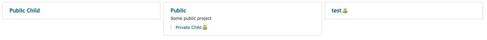
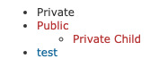

# Redmine Global Toc plugin

This is a plugin for Redmine with wiki macro that collects all projects available to the user and form the global Redmine Table of Content with links to all wikis for the user. 

## Example

#### Projects structure


#### Wiki format
```
{{global_toc}}
```

#### Resulting view


## Installation

1. Clone or copy files into the Redmine plugins directory
   ```
   git clone https://github.com/hitsoft-redmine/redmine_global_toc.git plugins/redmine_global_toc
   ```
2. Restart Redmine

## License

[LGPL-3.0](LICENSE)